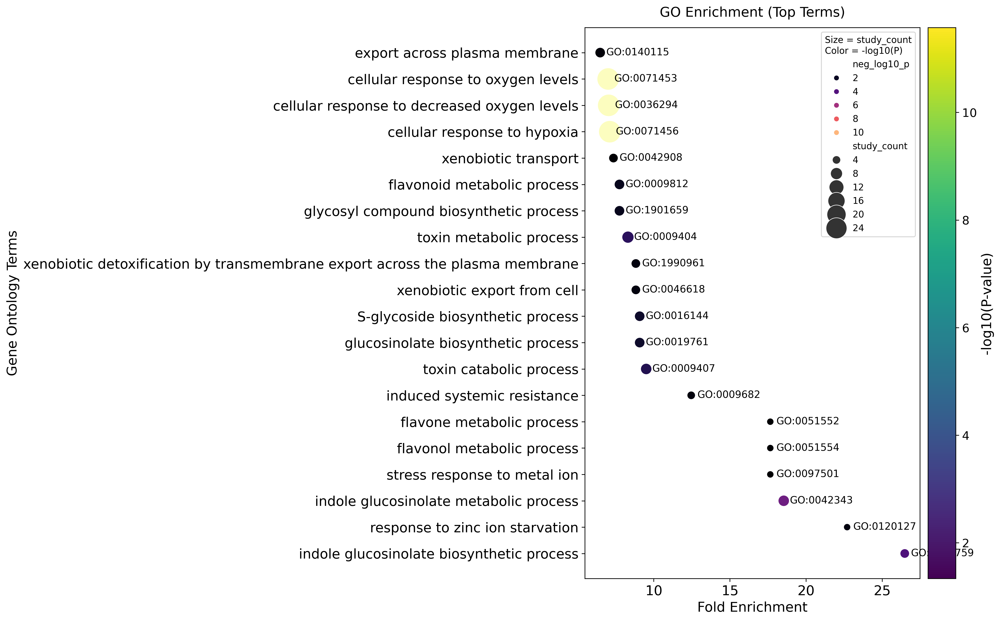

# GO Enrichment Analysis for RNA-seq DEGs
Welcome! This repository contains a Python script that performs Gene Ontology (GO) enrichment analysis on a list of differentially expressed genes (DEGs). The approach leverages the [goatools](https://github.com/tanghaibao/goatools) library to identify significantly enriched GO terms, visualize the results, and summarize insights from your RNA-seq experiment. I have used differentially expressed genes from a previous [RNAseq analysis](https://github.com/linkangit/RNAseq-analysis-PyDESeq2) done on data obtained from one of my published articles [Dash et.al 2023](https://doi.org/10.1093/plphys/kiad465).

This document describes a Python script that performs Gene Ontology (GO) enrichment analysis on a set of differentially expressed genes (DEGs) from an RNA-seq experiment. The code uses the `goatools` library to identify and visualize GO terms that are overrepresented in the DEGs compared to a background gene set.

---

## Table of Contents
1. [Overview](#overview)
2. [Files and Inputs](#files-and-inputs)
3. [Key Steps in the Script](#key-steps-in-the-script)
4. [Why Perform GO Enrichment Analysis in RNA-seq?](#why-perform-go-enrichment-analysis-in-rna-seq)
5. [Running the Script](#running-the-script)
6. [Output and Visualization](#output-and-visualization)
7. [Possible Extensions and Applications](#possible-extensions-and-applications)
8. [Summary](#summary)

---

## Overview
1. **Goal:** To identify which biological processes, molecular functions, or cellular components are significantly enriched in a set of DEGs from an Arabidopsis mutant vs. control study.  
2. **Method:** Uses the `goatools` package to perform enrichment analysis against a background gene set, obtains statistically significant GO terms, and visualizes the top 20 terms in a scatter plot.

---

## Files and Inputs
1. **DEG.txt**: Contains the list of differentially expressed genes (one per line).  
2. **all_genes.txt**: Contains the background (all genes) used for the enrichment test.  
3. **go-basic.obo**: Ontology file describing the hierarchy and relationships among GO terms.  
4. **gene_annotations_tair.gaf**: Gene association/annotation file mapping genes to GO terms.  

---

## Key Steps in the Script
1. **Installation of `goatools`:** Ensures the required library is installed.  
2. **Importing Libraries:** Imports `pandas`, `numpy`, `seaborn`, `matplotlib`, and various modules from `goatools`.  
3. **Reading Gene Lists:**  
   - Reads DEGs from `DEG.txt`.  
   - Reads background genes from `all_genes.txt`.  
4. **Loading GO Data:**  
   - Loads the GO DAG (Directed Acyclic Graph) from `go-basic.obo`.  
   - Reads GAF annotations into a map of gene-to-GO sets (`gene2go_map`).  
5. **Running Enrichment Analysis:**  
   - Creates a `GOEnrichmentStudy` object with:  
     - The background gene list,  
     - The gene-to-GO map,  
     - The GO DAG,  
     - Statistical settings (propagate counts, FDR–Benjamini-Hochberg correction, alpha=0.05).  
   - Filters the results to keep only significant GO terms (`p_fdr_bh < 0.05`).  
6. **Creating a Results DataFrame:**  
   - Stores GO term IDs, names, p-values, and fold enrichment metrics.  
   - Calculates `neg_log10_p` for visualization.  
7. **Sorting and Selecting Top 20 Terms:**  
   - Sorts by fold enrichment to find the most enriched GO terms.  
8. **Plotting:**  
   - Creates a scatter plot using `seaborn`, with:  
     - X-axis = Fold Enrichment,  
     - Y-axis = GO Terms,  
     - Point size = Number of genes in each term,  
     - Point color = –log10(P-value).  
   - Annotates each point with the GO ID.  
   - Saves the figure to `go_enrichment_plot.png`.  

---

## Why Perform GO Enrichment Analysis in RNA-seq?
When you identify a set of genes that are differentially expressed (DE), it is often important to understand their biological roles. GO enrichment analysis allows you to:
1. **Link DE Genes to Biological Functions:** Identify which processes, functions, or components might be driving the observed changes.  
2. **Generate Biological Hypotheses:** Pinpoint relevant pathways or molecular mechanisms to focus on in further experiments.  
3. **Prioritize Further Validation:** Highlight potential candidate biomarkers or targets for genetic manipulation by focusing on biologically meaningful terms.

---

## Running the Script
1. **Install prerequisites:**
   - `pip install goatools pandas seaborn matplotlib`
2. **Place files in working directory:** Ensure that `DEG.txt`, `all_genes.txt`, `go-basic.obo`, and `gene_annotations_tair.gaf` are all in the same folder (or update paths in the script).
3. **Execute the script:** Run the Python script (e.g., `python go_enrichment_script.py`) in the terminal or in a Jupyter notebook cell.

---

## Output and Visualization
- The script prints statistics (e.g., number of genes in input, significant GO terms).  
- A scatter plot (`go_enrichment_plot.png`) showing the top 20 enriched GO terms is generated, illustrating:  
  - Fold Enrichment on the X-axis,  
  - GO Terms on the Y-axis,  
  - Point size representing the number of genes in each term,  
  - Color scale corresponding to the –log10(FDR-corrected p-value).

---

## Possible Extensions and Applications
1. **Targeted GO Analysis:** Focus on specific GO terms of interest by filtering the `results_df` further.  
2. **Functional Clustering:** Use GO term clustering methods to group related terms and simplify interpretation.  
3. **Comparison of Multiple Conditions:** Perform GO enrichment for multiple DEG lists (e.g., different treatments or time points), then compare results.  
4. **Integration with Other Databases:** Combine with KEGG or Reactome pathways to see broader functional or metabolic contexts.  
5. **Other Organisms:** Adapt the script to different organisms by providing the correct gene annotation files and background lists.

---

## Summary
This script demonstrates how to perform GO enrichment on a set of DEGs derived from RNA-seq data in an Arabidopsis model. GO enrichment provides insights into the functional roles of significant genes, guiding further experimentation and hypothesis-driven research. By customizing the script, you can incorporate additional layers of analysis, examine other experiments or species, and create more detailed visualizations for publication or internal reporting.
